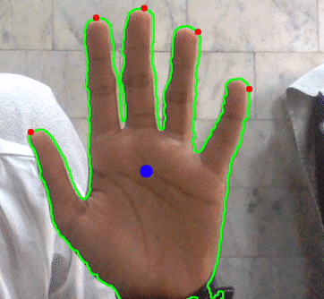

# handy
An easy to use wrapper for hand recognition, made using OpenCV 4.



```sh
import handy
import cv2

cap = cv2.VideoCapture(0)
hist = handy.capture_histogram(source=0)

while True:
    ret, frame = cap.read()
    
    # detect the hand
    hand = handy.detect_hand(frame, hist)
    
    # plot the fingertips
    for fingertip in hand.fingertips:
        cv2.circle(hand.outline, fingertip, 5, (0, 0, 255), -1)

    cv2.imshow("Handy", hand.outline)
    
    k = cv2.waitKey(5)
    if k == ord('q'):
        break
```

## Get started
1. Clone or download the repo, and then,
```sh
$ cd handy-master
$ pip install -r requirements.txt
$ python test.py
```
2. When the program starts, it'll pop open a web cam feed and you have to place a part of your hand in the rectangle shown and press the key 'a' to calibrate the system with your skin color and the detection process will start.
